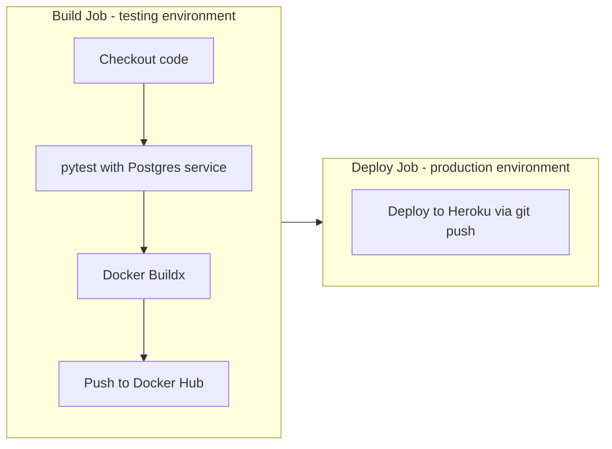

# Xisco API

A production-ready RESTful API built with **FastAPI** and **PostgreSQL**, showcasing real-world backend engineering practices including user authentication, resource management, and an engagement/voting system.

The project includes **automated testing**, **Docker containerization**, and a **GitHub Actions CI/CD pipeline** that runs tests, publishes a Docker image to Docker Hub, and deploys to Heroku — reflecting the type of backend systems designed and delivered during client engagements.

**Live API:** [https://xisco-api-b58807d67a65.herokuapp.com](https://xisco-api-b58807d67a65.herokuapp.com)  
**API Docs (Swagger UI):** [https://xisco-api-b58807d67a65.herokuapp.com/docs](https://xisco-api-b58807d67a65.herokuapp.com/docs)  
**ReDoc:** [https://xisco-api-b58807d67a65.herokuapp.com/redoc](https://xisco-api-b58807d67a65.herokuapp.com/redoc)

---

## Table of Contents

- [Features](#features)
- [Tech Stack](#tech-stack)
- [Project Structure](#project-structure)
- [Database Models](#database-models)
- [API Endpoints](#api-endpoints)
- [Authentication](#authentication)
- [Getting Started](#getting-started)
- [Docker](#docker)
- [Testing](#testing)
- [CI/CD Pipeline](#cicd-pipeline)
- [Development Workflow](#development-workflow)
- [Environment Variables](#environment-variables)
- [Database Migrations](#database-migrations)
- [Deployment](#deployment)

---

## Features

- **JWT Authentication** — Secure login with OAuth2 password flow
- **Post Management** — Create, read, update, and delete posts (owner-only updates/deletes)
- **User Management** — Register and retrieve user profiles
- **Voting System** — Upvote posts and remove votes via a dedicated endpoint
- **Search & Pagination** — Filter posts by title with `limit`, `skip`, and `search` query params
- **Password Hashing** — Secure password storage using `pwdlib` (Argon2)
- **CORS Enabled** — Open CORS policy for flexible frontend integration
- **Pydantic v2 Schemas** — Strong request/response validation
- **Alembic Migrations** — Version-controlled database schema management
- **Vote Count Aggregation** — Posts returned with their total vote count
- **Automated Testing** — Pytest integration test suite with isolated test database
- **Docker Support** — Containerized API via Dockerfile and docker-compose
- **CI/CD Pipeline** — GitHub Actions workflow for test, build, and deploy

---

## Tech Stack

| Layer | Technology |
|---|---|
| Language | Python 3.10+ (tested with 3.13) |
| Framework | FastAPI 0.128.0 |
| ORM | SQLAlchemy 2.0.46 |
| Database | PostgreSQL (via psycopg2 2.9.11) |
| Migrations | Alembic 1.18.4 |
| Auth | JWT (PyJWT 2.11.0) + OAuth2 |
| Validation | Pydantic v2 (2.12.5) |
| Server | Uvicorn 0.40.0 |
| Testing | pytest + FastAPI TestClient |
| Container | Docker (Python 3.13.13 image) |
| CI/CD | GitHub Actions |
| Container Registry | Docker Hub (`xiscoapi:latest`) |
| Deployment | Heroku |

---

## Project Structure

```
Comp-API/
├── app/
│   ├── main.py              # App entry point, middleware, router registration
│   ├── models.py            # SQLAlchemy ORM models (Post, User, Vote)
│   ├── schemas.py           # Pydantic request/response schemas
│   ├── database.py          # Database connection & session setup
│   ├── config.py            # Environment variable configuration
│   ├── utils.py             # Password hashing & verification helpers
│   └── routers/
│       ├── post.py          # Post CRUD endpoints
│       ├── user.py          # User registration & retrieval
│       ├── auth.py          # Login & token generation
│       ├── vote.py          # Voting endpoint
│       └── Oauth2.py        # JWT token creation & validation
├── dbmigration/             # Alembic migration scripts
│   └── versions/            # Migration revision files
├── tests/                   # Pytest integration test suite
│   ├── conftest.py          # Fixtures (DB, client, users, posts, tokens)
│   ├── test_users.py
│   ├── test_posts.py
│   ├── test_votes.py
│   └── test_calculations.py
├── .github/workflows/
│   └── build-deploy.yml     # CI/CD pipeline (test, Docker push, Heroku deploy)
├── Dockerfile               # Container image definition
├── docker-compose.yml       # Docker orchestration (API service)
├── alembic.ini              # Alembic configuration
├── requirements.txt         # Python dependencies
├── Procfile                 # Heroku process definition
└── .gitignore
```

---

## Database Models

### `Post`
| Column | Type | Description |
|---|---|---|
| `id` | Integer (PK) | Auto-generated post ID |
| `title` | String | Post title |
| `content` | String | Post body content |
| `published` | Boolean | Visibility flag (default: `true`) |
| `created_at` | Timestamp | Auto-set creation time |
| `owner_id` | FK → users.id | Author of the post |

### `User`
| Column | Type | Description |
|---|---|---|
| `id` | Integer (PK) | Auto-generated user ID |
| `email` | String (unique) | User email address |
| `password` | String | Hashed password |
| `created_at` | Timestamp | Auto-set creation time |

### `Vote`
| Column | Type | Description |
|---|---|---|
| `user_id` | FK → users.id (PK) | Voter |
| `post_id` | FK → posts.id (PK) | Post being voted on |

---

## API Endpoints

### Authentication
| Method | Endpoint | Description | Auth Required |
|---|---|---|---|
| `POST` | `/login` | Login and receive JWT token | No |

### Users
| Method | Endpoint | Description | Auth Required |
|---|---|---|---|
| `POST` | `/users/` | Register a new user | No |
| `GET` | `/users/{id}` | Get user by ID | No |

### Posts
| Method | Endpoint | Description | Auth Required |
|---|---|---|---|
| `GET` | `/posts/` | Get all posts (with votes, pagination, search) | Yes |
| `POST` | `/posts/` | Create a new post | Yes |
| `GET` | `/posts/{id}` | Get a single post by ID | Yes |
| `PUT` | `/posts/{id}` | Update a post (owner only) | Yes |
| `DELETE` | `/posts/{id}` | Delete a post (owner only) | Yes |

### Votes
| Method | Endpoint | Description | Auth Required |
|---|---|---|---|
| `POST` | `/vote/` | Vote on a post (`dir: 1` = add vote, any other value = remove vote) | Yes |

#### Query Parameters for `GET /posts/`
| Param | Type | Default | Description |
|---|---|---|---|
| `limit` | int | `10` | Max number of posts to return |
| `skip` | int | `0` | Number of posts to skip (offset) |
| `search` | string | `""` | Filter posts by title keyword |

#### Response Shapes

- **Posts** — List and single-post responses use `PostOut`: a nested `Post` object (with `owner`) plus a `votes` count.
- **Votes** — Returns `{ "message": "successfully added vote" }` or `{ "message": "successfully deleted vote" }`.
- **Auth** — Login returns `{ "access_token": "...", "token_type": "bearer" }`.

#### Error Behavior (selected)

| Scenario | Status |
|---|---|
| Duplicate upvote on same post | `409 Conflict` |
| Remove vote that does not exist | `404 Not Found` |
| Update/delete post you do not own | `403 Forbidden` |

---

## Authentication

This API uses **OAuth2 with JWT Bearer tokens**.

1. Register via `POST /users/`
2. Login via `POST /login` with your `email` (as `username`) and `password`
3. Copy the returned `access_token`
4. Include it in the `Authorization` header for protected routes:

```
Authorization: Bearer <your_token>
```

You can also use the **Authorize** button in the [Swagger UI](https://xisco-api-b58807d67a65.herokuapp.com/docs) to authenticate directly.

---

## Getting Started

### Prerequisites

- Python 3.10+ (tested with 3.13)
- PostgreSQL database
- `pip`

### Installation

```bash
# 1. Clone the repository
git clone https://github.com/StanleyXisco/Comp-API.git
cd Comp-API

# 2. Create and activate a virtual environment
python -m venv venv
source venv/bin/activate  # On Windows: venv\Scripts\activate

# 3. Install dependencies
pip install -r requirements.txt

# 4. Create a .env file (see Environment Variables section below)

# 5. Run database migrations
alembic upgrade head

# 6. Start the development server
uvicorn app.main:app --reload
```

The API will be available at `http://localhost:8000`  
Swagger docs at `http://localhost:8000/docs`  
ReDoc at `http://localhost:8000/redoc`

---

## Docker

The project includes a [Dockerfile](Dockerfile) and [docker-compose.yml](docker-compose.yml) for containerized runs.

### Build and run with Docker

```bash
# Build the image
docker build -t xiscoapi .

# Run the container (requires a reachable PostgreSQL instance and env vars)
docker run -p 8000:8000 \
  -e DATABASE_HOSTNAME=host.docker.internal \
  -e DATABASE_PORT=5432 \
  -e DATABASE_PASSWORD=your_password \
  -e DATABASE_NAME=your_db_name \
  -e DATABASE_USERNAME=your_db_user \
  -e SECRET_KEY=your_jwt_secret_key \
  -e ALGORITHM=HS256 \
  -e ACCESS_TOKEN_EXPIRE_MINUTES=30 \
  xiscoapi
```

### Run with docker-compose

```bash
docker compose up --build
```

The API is exposed on `http://localhost:8000`.

### Docker notes

| Topic | Detail |
|---|---|
| Base image | `python:3.13.13` |
| Container port | `8000` (fixed in Dockerfile) |
| Heroku port | Uses `$PORT` via `Procfile` (default `5000`) |
| PostgreSQL | Not included in `docker-compose.yml` — provide an external database and pass env vars |
| Migrations | Run `alembic upgrade head` separately before or after starting the container |
| Production deploy | Heroku runs from source + `Procfile`, not the Docker image |

The CI pipeline also builds and pushes the image to Docker Hub as `{DOCKER_HUB_USERNAME}/xiscoapi:latest`.

---

## Testing

The test suite lives in [`tests/`](tests/) and uses **pytest** with FastAPI's `TestClient`.

### Run tests

```bash
pip install pytest
pytest
```

### Test database

Tests use a separate database named `{DATABASE_NAME}_test` to avoid affecting development data. The same `DATABASE_*` and auth env vars from your `.env` are required.

`conftest.py` provides fixtures for:

- `session` — isolated SQLAlchemy session (tables dropped/recreated per test)
- `client` — FastAPI TestClient with DB dependency override
- `test_user` / `test_user2` — registered test users
- `token` / `authorized_client` — JWT-authenticated client
- `test_posts` — seeded post data

### Test coverage

| File | Areas covered |
|---|---|
| `test_users.py` | Root endpoint, user registration, login, invalid credentials |
| `test_posts.py` | CRUD, pagination, auth guards, owner-only update/delete |
| `test_votes.py` | Add vote, duplicate vote, delete vote, unauthorized access |
| `test_calculations.py` | Standalone utility module tests (not part of the API) |

---

## CI/CD Pipeline

Automated builds and deployments are defined in [`.github/workflows/build-deploy.yml`](.github/workflows/build-deploy.yml). The workflow runs on every `push` and `pull_request`.



### Build job (`testing` environment)

1. Check out the repository
2. Set up Python 3.13 and install dependencies from `requirements.txt`
3. Start a PostgreSQL service container for tests
4. Install pytest and run the full test suite
5. Log in to Docker Hub
6. Build and push the Docker image (`{DOCKER_HUB_USERNAME}/xiscoapi:latest`)

### Deploy job (`production` environment)

1. Install the Heroku CLI
2. Deploy to Heroku using `akhileshns/heroku-deploy@v3.15.15` (git-based push)

Production runs via the Heroku Python buildpack and [`Procfile`](Procfile), not the Docker image.

### Required GitHub Secrets

| Secret | Purpose |
|---|---|
| `DATABASE_HOSTNAME` | Postgres host for CI tests |
| `DATABASE_PORT` | Postgres port |
| `DATABASE_PASSWORD` | Postgres password |
| `DATABASE_NAME` | Base database name (tests use `{DATABASE_NAME}_test`) |
| `DATABASE_USERNAME` | Postgres user |
| `SECRET_KEY` | JWT signing key for tests |
| `ALGORITHM` | JWT algorithm (e.g. `HS256`) |
| `ACCESS_TOKEN_EXPIRE_MINUTES` | Token expiry for tests |
| `DOCKER_HUB_USERNAME` | Docker Hub account |
| `DOCKER_HUB_ACCESS_TOKEN` | Docker Hub access token |
| `HEROKU_API_KEY` | Heroku API key |
| `HEROKU_APP_NAME` | Heroku application name |
| `HEROKU_EMAIL` | Heroku account email |

---

## Development Workflow

A typical local development cycle:

1. **Start PostgreSQL** and configure your `.env` file
2. **Apply migrations** — `alembic upgrade head`
3. **Run the API** — `uvicorn app.main:app --reload`
4. **Make changes** to routers, models, or schemas
5. **Create migrations** when models change — `alembic revision --autogenerate -m "description"`
6. **Run tests** — `pytest`
7. **Push to GitHub** — CI runs tests, builds the Docker image, and deploys to Heroku

For container-based development, use the [Docker](#docker) section above (with an external Postgres instance).

---

## Environment Variables

Create a `.env` file in the root directory with the following:

```env
DATABASE_HOSTNAME=localhost
DATABASE_PORT=5432
DATABASE_PASSWORD=your_password
DATABASE_NAME=your_db_name
DATABASE_USERNAME=your_db_user
SECRET_KEY=your_jwt_secret_key
ALGORITHM=HS256
ACCESS_TOKEN_EXPIRE_MINUTES=30
```

These are loaded by [`app/config.py`](app/config.py) via Pydantic Settings. The `.env` file is gitignored.

---

## Database Migrations

This project uses **Alembic** for database migrations. Migration scripts are in [`dbmigration/versions/`](dbmigration/versions/).

```bash
# Create a new migration
alembic revision --autogenerate -m "your migration message"

# Apply migrations
alembic upgrade head

# Rollback one step
alembic downgrade -1
```

Schema changes are managed exclusively through Alembic — `create_all()` in `app/main.py` is intentionally disabled.

---

## Deployment

### Automated (CI/CD)

On every push to the default branch, the GitHub Actions pipeline runs tests and deploys to Heroku automatically (see [CI/CD Pipeline](#cicd-pipeline)).

### Manual Heroku deployment

The API runs on Heroku using the [`Procfile`](Procfile):

```
web: uvicorn app.main:app --host=0.0.0.0 --port=${PORT:-5000}
```

To deploy your own instance:

```bash
heroku create your-app-name
heroku addons:create heroku-postgresql:mini
heroku config:set SECRET_KEY=your_secret ALGORITHM=HS256 ACCESS_TOKEN_EXPIRE_MINUTES=30
git push heroku main
heroku run alembic upgrade head
```

Set the `DATABASE_*` config vars via the Heroku Postgres addon or manually in the Heroku dashboard.

---

> Built by [StanleyXisco](https://github.com/StanleyXisco)
